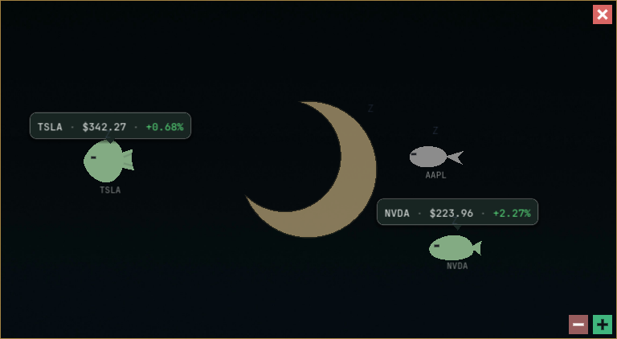
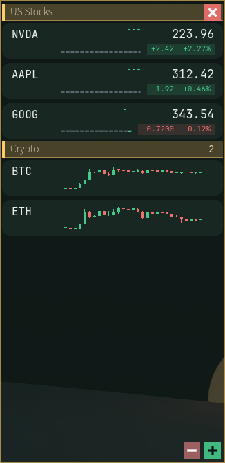
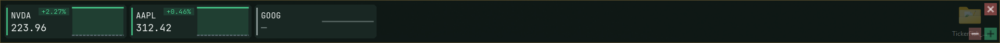
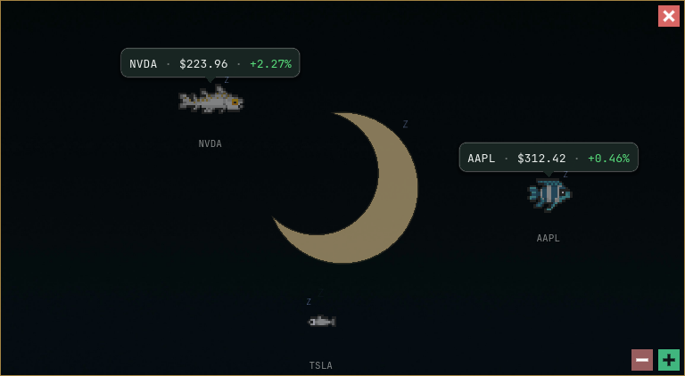

# 看盘鱼 Tickerfish 🐠


会游泳的桌面行情。自选标的活在一个透明置顶的窗口里——可以是随涨跌变色的鱼，也可以是数字列表、
轮播大卡，或者屏幕顶部的一条横幅。

<p align="center">
  
</p>

Godot 4.6 / GDScript，Windows。 &nbsp;·&nbsp; [English](README.md)

> [!WARNING]
> **不构成投资建议。** 仅为娱乐性可视化，价格有延迟，可能与你的券商不一致。见[数据说明](#数据说明)。

<details>
<summary><b>关于这个项目</b> —— 它为什么存在，以及别期待什么</summary>

<br>

我只是想做一个自己的软件, 我并不是专业程序员,当然地我用了AI 全程辅助我开发了这个程序.
我创作这个程序的初衷也只是想做一个东西自己玩并且完成自己一个人生目标. 过去这几个月开发这个软件
我玩得很开心, 也体验了一把程序员的生活.

我并没有像专业程序员那样一直跟踪开发版本, 所以当前版本定位v0.99, 也就是说这从来都不是一个正式
发布版. 这也很可能是最后一版. 相对于开发专业人员和专业程序员, 我从来没用过GITHUB, 所以后续的
开发计划和更新计划我还没有定. 欢迎 fork、修改、随意使用, 我可能会不经意在我自己的版本加点功能
更新下BUG并上传, 但请不要期待后续维护、修 bug 或技术支持. 玩得开心.

祝好,
**DCW**

</details>

---

## 显示模式

| 模式 | 说明 |
|---|---|
| **鱼缸** | 每个标的一条鱼，颜色跟随当日涨跌；闭市时鱼会睡觉。 |
| **数字列表** | 按市场分组的滚动列表，带日内蜡烛。 |
| **轮播大卡** | 大卡片轮流展示一组命名标的。 |
| **顶部横幅** | 横跨屏幕顶端的一条。拖动卡片可调整顺序，拖进另一个组即加入该组。 |

<table>
<tr>
<td align="center" width="45%">
  <br>
  <sub><b>数字列表</b> —— 按市场分组，带日内蜡烛</sub>
</td>
<td align="center">
  <br>
  <sub><b>鱼缸</b> —— 闭市时鱼在睡觉</sub>
</td>
</tr>
</table>

<p align="center">
  <br>
  <sub><b>顶部横幅</b> —— 横跨屏幕顶端的一条</sub>
</p>

### 动起来是什么样

几段短片，无声音：

- [`Tfv1.mp4`](Showcase/Tfv1.mp4) —— 轮播大卡
- [`TFv2.mp4`](Showcase/TFv2.mp4) —— 鱼缸模式

---

## 上手

### 只想跑起来

到 [最新 Release](../../releases/latest) 下载 `.zip`，解压，双击 `Tickerfish.exe`。不需要装任何东西。

两件事要注意：

- **解压到可写目录** —— 桌面或文档都行，`C:\Program Files` 不行。Tickerfish 会把 `DataBridge/`
  和 `api_config.json` 写在可执行文件旁边，没有权限时这些写入会静默失败。
- **Windows 和杀毒软件都会报警。** 见下 —— 这是预料之中的，而且我解决不了。

> [!WARNING]
> **首次运行会遇到两个警告。**
>
> Windows SmartScreen 弹「Windows 已保护你的电脑」—— 点 **更多信息 → 仍要运行**。
> Norton 会直接报毒，有时其它引擎也会，Windows Defender 也可能警告。
>
> 这是 Godot 打包程序上众所周知的误报：整个引擎和全部资源被压进一个自解压的可执行文件里，
> 而这个形态正是启发式扫描器判定为「投放器」的特征。这个 exe 也确实没有代码签名 ——
> 证书一年好几百美元，而这是个免费的爱好项目。
>
> 我修不了这个。你能做的，按偏执程度递增：
>
> - 用同一个 Release 里附的 `SHA256SUMS.txt` 核对下载的文件。
> - 把 `.exe` 传到 [VirusTotal](https://www.virustotal.com/) 看多少引擎有意见。
> - 读一下[构建脚本](.github/workflows/build-windows.yml)。每个 Release 都由 GitHub Actions
>   从本仓库构建，从来没有任何二进制文件是从我本机上传的。
> - 干脆别下载，自己从源码构建。方法见下。
>
> 如果杀毒软件把它隔离了而你还是想跑，得自己加白名单。与其假装这个警告不存在，不如直说。

### 或者从源码运行

Godot 4.6，渲染器选 **GL Compatibility**（透明置顶窗口依赖它）：

```bash
godot --path /path/to/Tickerfish
```

### 或者自己导出 .exe

在 Godot 里打开项目，按提示装好导出模板，然后 **项目 → 导出 → Windows Desktop → 导出项目**，
预设已在仓库里。

---

**加密货币开箱即用。** BTC、ETH 以及 Binance 上的其它币种都不需要 API 密钥。

<details>
<summary><b>美股需要一个免费的 Finnhub 密钥</b> —— 五步</summary>

<br>

1. 在 <https://finnhub.io/register> 注册。
2. 确认验证邮件。
3. 登录后进入 Dashboard。
4. 复制顶部框里的 **API Key**（不是 Webhook，也不是 Security）。
5. 在软件里：右键 → 设置 → API Key 设置 → 粘贴 → 保存。

保存时会校验密钥。密钥存在可执行文件旁的 `api_config.json` 里，不上传到任何地方。
`api_config.example.json` 是空白模板。

> [!CAUTION]
> `api_config.json` 里的密钥是明文的。**把整个程序目录打包发给别人之前，先把它清空** ——
> 否则你的密钥会跟着一起走。

Finnhub 免费档面向个人使用；如需商业用途请查阅其条款。

</details>

---

## 还有这些

- **命名鱼缸** —— 最多 10 个，右键菜单切换。
- **价格提醒** —— 当日涨跌幅每上一个阈值档提醒一次。设 5% 就在 5%、10%、15% 各响一次，涨跌分开
  计档，按交易日清零。
- **价格记录** —— 每 15、30 或 60 分钟采样一次写入 CSV。
- **中文 / English**，三套配色。

---

## 鱼的皮肤

默认的**极简**皮肤是三条矢量鱼，随软件附带，不需要额外准备。

可选的**美术**皮肤可以渲染 [Elthen 的 2D Pixel Art Fish Pack](https://elthen.itch.io/2d-pixel-art-fish-pack)，
它带来 12 种像素鱼。

<table>
<tr>
<td align="center" width="50%">
  <br>
  <sub><b>极简</b> —— 随软件附带</sub>
</td>
<td align="center" width="50%">
  <br>
  <sub><b>美术</b> —— 需要另行购买素材包</sub>
</td>
</tr>
</table>

该素材付费且不允许再分发，所以 **Tickerfish 不附带任何第三方鱼美术**。如果你已经拥有它：
右键 → **鱼的样式 → 美术鱼素材…** 会打开一个面板，显示确切文件夹、一个打开文件夹的按钮和一个
检测按钮，把 `Fishes Sprite Sheet.png` 放进去即可立即识别启用。

素材的授权来自 Elthen 本人，与 Tickerfish 无关。[使用前请先阅读许可条款](https://www.patreon.com/posts/27430241)
—— 其中对区块链与加密货币相关用途有限制，而 Tickerfish 可以显示加密货币行情。

📖 **分步安装、鱼种选择与排查：[FISH-ART-GUIDE.zh-CN.md](FISH-ART-GUIDE.zh-CN.md)**

> **我个人的话：**
>
> 我自己是更倾向用 Elthen 的美术鱼的，它确实把这个软件的观感带上了另一个层次，所以我给自己买了
> 一份素材包。拦着我把它随软件一起发出去的是许可条款，不是别的。
>
> 如果你也希望鱼好看一些，我建议你也买一份。买了之后，软件里会引导你怎么用。
>
> —— DCW

美术：[Elthen](https://elthen.itch.io/)。

---

## 上限

| | |
|---|---|
| 全局唯一标的（所有鱼缸与列表合计） | 50 |
| 每个鱼缸 | 20 |
| 鱼缸个数 | 10 |
| 数字列表条目 | 30 |

50 这个上限让轮询压在 Finnhub 免费额度的 60 次/分之内。

---

## 数据说明

- 股价每 60 秒刷新一次（`api_config.json` 里的 `min_interval_seconds`），**不是实时**。免费档 API
  通常把美股数据延迟 15–20 分钟。
- 开市与休市以数据源返回的交易所状态为准；没有 API 密钥时回落到内置的 NYSE 日历，可能与交易所
  实际安排有出入。
- 不显示盘前盘后成交。美东 16:00 收盘后显示常规交易时段的收盘价。
- 交易时段按美东时间，自动跟随美国夏令时，与本地时区无关。
- 加密价格来自 Binance 公开数据镜像，7×24，CoinGecko 作为兜底。

---

## 开发

GDScript 全在 `scripts/`；场景、`project.godot` 与 autoload 注册在仓库根目录。界面文字全部在
`i18n/strings.json`，`en` 与 `zh` 两份。

```bash
godot --headless --path . res://tests/regression_test.tscn
```

退出码 0 表示通过，每条断言会打印 PASS 或 FAIL。

> [!IMPORTANT]
> **这套测试跑的是真实存档。** 它会先备份 `user://save.json`、`user://bars_cache.json` 和
> `DataBridge` 下的 JSON，跑完还原并逐个 md5 校验。跑之前先关掉正在运行的实例。

<details>
<summary><b>几条从源码里看不出来的约束</b></summary>

<br>

- GL Compatibility 渲染器下，无边框的**不透明**子窗口会渲染成全黑。所以次级窗口一律用系统边框，
  只有透明的主窗口和提示弹窗是无边框的。
- 主窗口的一切绘制都在 `fish_tank_window._draw()` 里。挂了 `show_behind_parent` 的子 `Control`
  在这里画不出东西。
- 次级窗口的尺寸常量在 `tide_dialog_window.gd`，要改改那里，不要逐个对话框改。
- CJK 字体是内嵌的。不要退回 `SystemFont` —— 干净的 Windows 装机没有中文字体，会显示成豆腐块。
- `api.binance.com` 在部分地区返回 HTTP 451，不可使用；加密数据只走那两个公开镜像。
- 美术鱼皮肤的精灵图是第三方付费素材，绝不能进仓库。它在运行时从 `FishArt/` 读取，位于 `res://`
  之外，也在 Godot 的导入管线之外。`assets/` 下的一切都是本项目原创。

</details>

---

## 许可协议

[MIT](LICENSE) © 2026 DeepCreepWonderer

第三方组件与其许可：[THIRD-PARTY-NOTICES.md](THIRD-PARTY-NOTICES.md)
